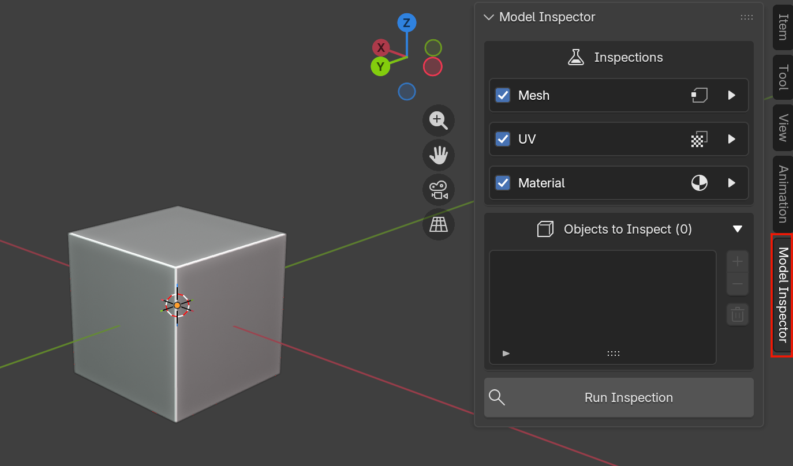
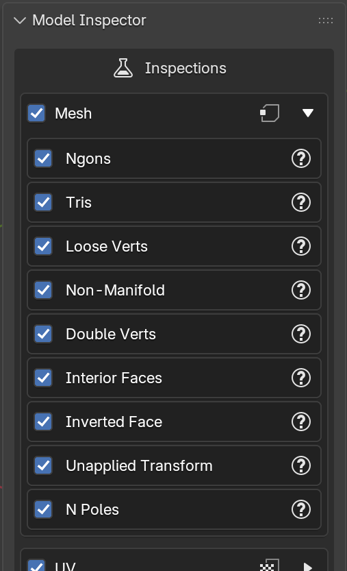
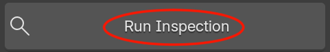
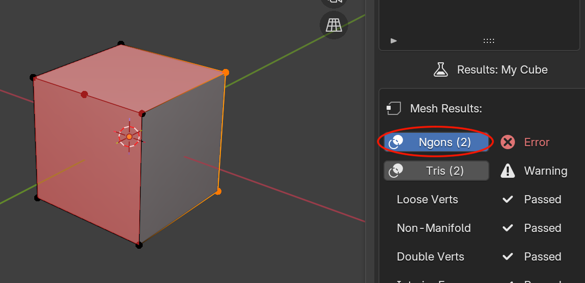

# Quick Start

This walks through a first inspection from an empty scene to reading results.

1. **Open the panel.** In the 3D Viewport, press ++n++ to open the sidebar, then select the **Model Inspector** tab.

    

2. **Select objects.** In the viewport, select one or more mesh objects you want to inspect.

3. **Add them to the inspection list.** In the *Objects to Inspect* box, click ➕ to add the current selection.

    

4. **Choose what to inspect.** In the *Inspections* box, tick or untick the **Mesh**, **UV**, and **Material** categories. Expand a category to enable or disable individual inpsections. You can hover over the ❓ icon next to any inspection for a description of what it looks for.

    

5. **Run Inspection.** Click the **Run Inspection** button at the bottom of the panel.

    

6. **Read the results.** Select an object in the list to see its results grouped by category, with a pass/warning/error icon and an infraction count next to each check.

    

7. **Locate problem geometry.** Some results come with an overlay with a colored overlay toggle in the viewport showing exactly which faces, vertices, or edges were flagged.

    

8. **IMPORTANT**. To get the must up to date results, if you make any changes to your model, you **MUST RE-RUN YOUR INSPECTION** 

That's the whole loop. For a deeper look at each part of the panel, see the [User Guide](../user-guide/interface-overview.md).
