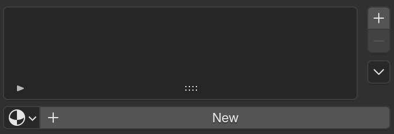

# Material Inspections

Inspections in the **Material** category look at material slots and the node trees of assigned materials.

## No Material Assigned

**Severity:** :material-close-circle:{ style="color: #e0392b" } Error

Finds meshes that have faces but zero material slots. Without a material, the object falls back to Blender's default viewport/render material.

{ style="display: block; margin: 0 auto;" }

## Empty Material Slot

**Severity:** :material-close-circle:{ style="color: #e0392b" } Error

Finds material slots that exist on the object but have no material assigned to them. The count shown is the number of empty slots.

{ style="display: block; margin: 0 auto;" }

## Face With No Material

**Severity:** :material-close-circle:{ style="color: #e0392b" } Error

Finds faces whose material slot index is empty or points outside the object's slot list. These faces render with no material.

{ style="display: block; margin: 0 auto;" }

## Missing Image Texture

**Severity:** :material-close-circle:{ style="color: #e0392b" } Error

Finds faces whose assigned material contains an Image Texture node (including inside node groups) with no image loaded. Renders as pink/black in Blender and most engines.

{ style="display: block; margin: 0 auto;" }

## Duplicate Material

**Severity:** :material-alert:{ style="color: #e6a700" } Warning

Finds materials with a Blender auto-generated `.001`style duplicate name, where the original un-suffixed material also still exists in the file. This usually means the same material was accidentally appended or duplicated instead of reused.

{ style="display: block; margin: 0 auto;" }

