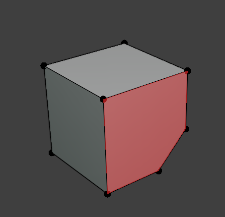
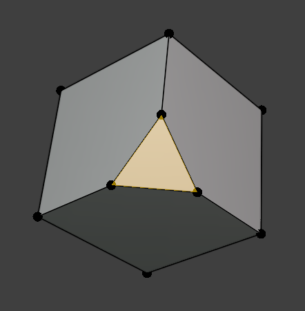
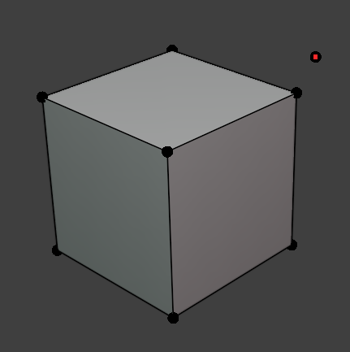
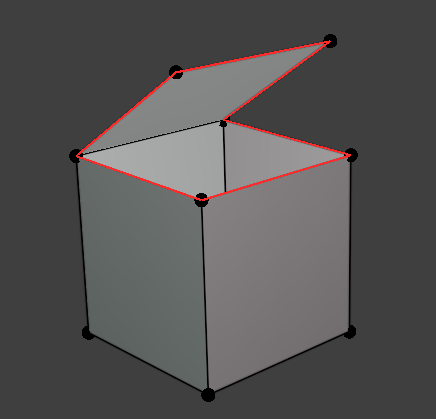
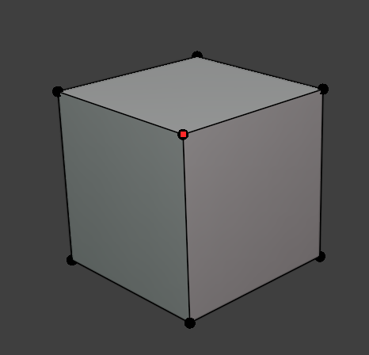
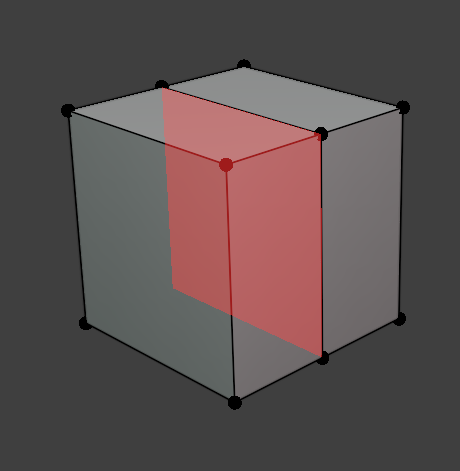
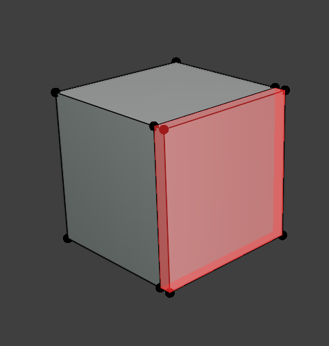
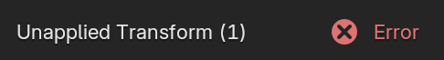
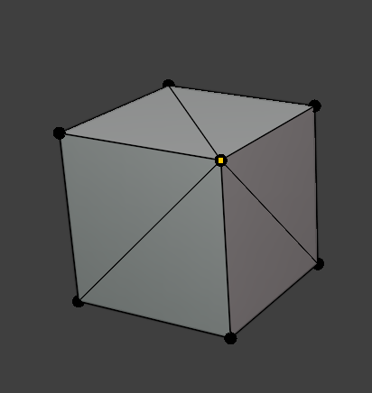

# Mesh Inspections

Inspections in the **Mesh** category look at topology and transforms. All of them read the object's evaluated mesh (post-modifiers) unless noted otherwise.

!!! note "Inspection Note"
    Many of these mesh inspections detect common issues that are **not always** an issue for meshes. If you for example are using Ngons in your workflow, feel free to disable that inspection.   

## Ngons

**Severity:** :material-close-circle:{ style="color: #e0392b" } Error

Finds faces with more than 4 vertices. N-gons can triangulate unpredictably, cause shading artifacts, and often indicate topology that hasn't been cleaned up. 

{ style="display: block; margin: 0 auto;" }

## Tris

**Severity:** :material-alert:{ style="color: #e6a700" } Warning

Finds triangular faces (3 vertices). Not necessarily an error as tris are sometimes intentional or unavoidable. However it is worth reviewing this if you expect an all-quad mesh for subdivision or retopology work.

{ style="display: block; margin: 0 auto;" }

## Loose Verts

**Severity:** :material-close-circle:{ style="color: #e0392b" } Error

Finds vertices that aren't connected to any edge. These add nothing to the mesh and are usually leftover from deleting geometry.

{ style="display: block; margin: 0 auto;" }

## Non-Manifold

**Severity:** :material-close-circle:{ style="color: #e0392b" } Error

Finds edges shared by a number of faces other than 2 (i.e. boundary edges shared by only 1 face, or edges shared by 3+ faces). Non-manifold geometry can break modifiers, booleans, and 3D printing/export pipelines.

{ style="display: block; margin: 0 auto;" }

## Double Verts

**Severity:** :material-close-circle:{ style="color: #e0392b" } Error

Finds vertices within a small merge threshold (`0.0001`, matching Blender's default *Merge by Distance*) of another vertex. Duplicate, coincident vertices usually mean an accidental merge failure or import artifact.

{ style="display: block; margin: 0 auto;" }

## Interior Faces

**Severity:** :material-close-circle:{ style="color: #e0392b" } Error

Finds faces where **every** edge is shared by more than 2 faces. Indicates that geometry is buried inside the mesh with no exterior boundary. Common after boolean operations or bad merges.

{ style="display: block; margin: 0 auto;" }

## Inverted Face

**Severity:** :material-close-circle:{ style="color: #e0392b" } Error

Finds faces whose normal disagrees with a neighboring face across a shared edge. Inverted normals cause inside-out shading and lighting errors.

**Overlay:** highlighted faces.

{ style="display: block; margin: 0 auto;" }

## Unapplied Transform

**Severity:** :material-close-circle:{ style="color: #e0392b" } Error

Finds objects with a rotation or scale that hasn't been applied (i.e. the object's rotation/scale isn't identity). Unapplied transforms can cause inconsistent behavior with modifiers, physics, and exports.

{ style="display: block; margin: 0 auto;" }

## N Poles

**Severity:** :material-alert:{ style="color: #e6a700" } Warning

Finds vertices connected to 6 or more edges (high valence). High-valence poles tend to cause visible pinching under subdivision.

{ style="display: block; margin: 0 auto;" }

