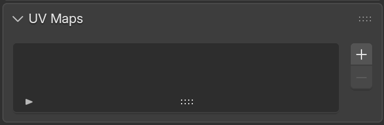
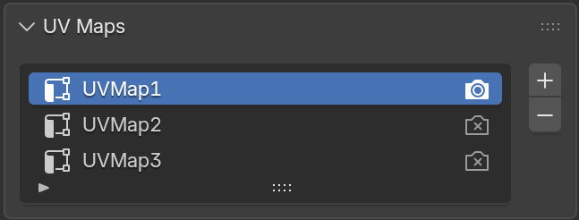
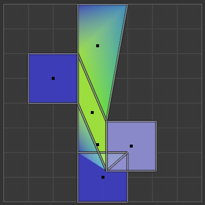
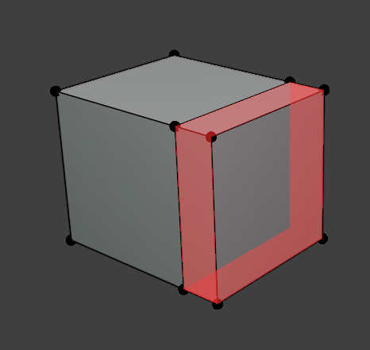
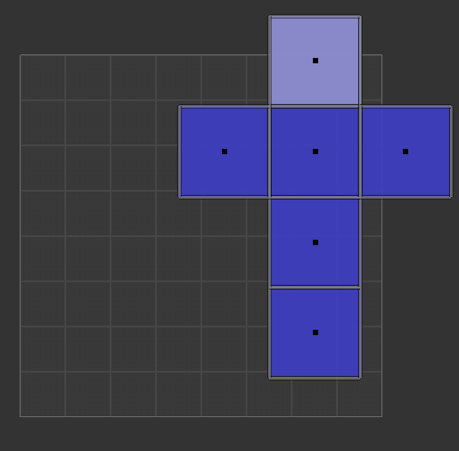
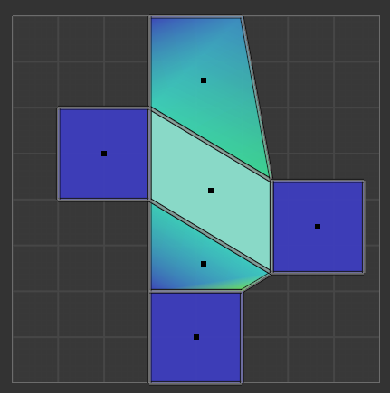
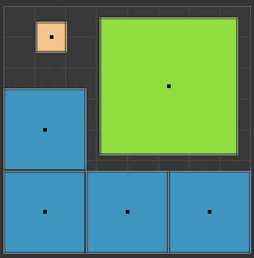

# UV Inspections

Inspections in the **UV** category look at the object's active UV map.

## Missing UV Map

**Severity:** :material-close-circle:{ style="color: #e0392b" } Error

Finds meshes that have no UV layer at all. Without UVs, texturing and baking aren't possible.

{ style="display: block; margin: 0 auto;" }

## Extra UV Maps

**Severity:** :material-alert:{ style="color: #e6a700" } Warning

Finds meshes with more than one UV map. Extra, unused UV maps bloat file size and can cause confusion about which map is actually used for texturing/baking. 

{ style="display: block; margin: 0 auto;" }

## Overlapping UVs

**Severity:** :material-alert:{ style="color: #e6a700" } Warning

Finds faces whose UV islands overlap another face's UVs. Overlapping UVs are sometimes intentional (tiling/mirrored islands) but can cause unwanted texture bleed when baking.

{ style="display: block; margin: 0 auto;" }

## Zero Area UVs

**Severity:** :material-close-circle:{ style="color: #e0392b" } Error

Finds faces collapsed to zero or near-zero area in UV space. A face with no UV area can't display a texture correctly. Normally occurs when a proper UV unwrap has yet to be performed.

{ style="display: block; margin: 0 auto;" }

## UVs Out of 0-1 Bounds

**Severity:** :material-alert:{ style="color: #e6a700" } Warning

Finds faces with UV coordinates outside the standard 0–1 tile. Sometimes intentional (UDIMs, tiling), but often means the UVs need to be packed.

{ style="display: block; margin: 0 auto;" }

## Stretched UVs

**Severity:** :material-alert:{ style="color: #e6a700" } Warning

Finds faces with stretched UVs, relative to their 3D shape where the mapping is compressed along one direction and expanded along another, rather than scaled evenly. 

{ style="display: block; margin: 0 auto;" }

## Inconsistent Texel Density

**Severity:** :material-alert:{ style="color: #e6a700" } Warning

Finds faces whose UV texel density deviates significantly from the mesh's average. Faces mapped notably denser or sparser than that average are flagged.

{ style="display: block; margin: 0 auto;" }
