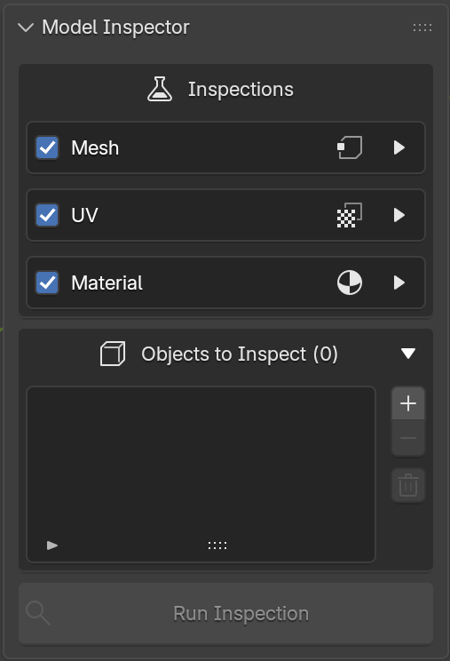
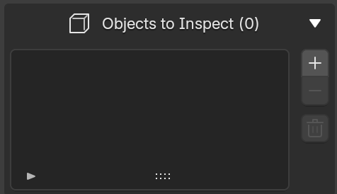
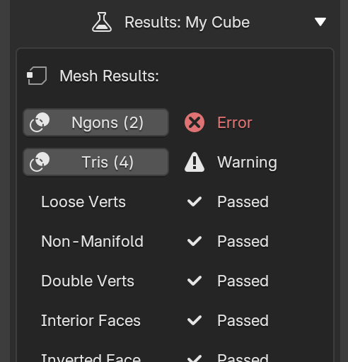
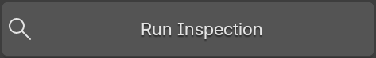

# Interface Overview

Model Inspector lives in the 3D Viewport sidebar (press ++n++), under its own **Model Inspector** tab. The panel is split into three sections.

{ style="display: block; margin: 0 auto;" }

## Inspections

Controls which inpections run. Each category — **Mesh**, **UV**, **Material** — has:

- A checkbox next to the category name to enable or disable the whole category.
- A chevron (▶ / ▼) to expand the category and reveal its individual inspections.

Inside an expanded category, each inspection has its own checkbox to enable/disable it independently, and a ❓ button that shows a tooltip describing what it looks for.

A category's individual inspection is only used when the category checkbox itself is also enabled.

## Objects to Inspect

{ style="display: block; margin: 0 auto;" }

A list of the objects that will be checked when you run an inspection.

- **➕ Add Object** — adds every currently-selected object to the list (duplicates are skipped).
- **➖ Remove Object** — removes the active row from the list.
- **🗑 Clear List** — empties the list entirely

Selecting a row shows a **Results** section below the list with that object's outcome for every check that ran. See [Reading Results & Overlays](results-and-overlays.md) for details.

{ style="display: block; margin: 0 auto;" }

## Run Inspection

{ style="display: block; margin: 0 auto;" }

The button at the bottom of the panel runs every enabled check, for every enabled category, against every object currently in the inspection list.

Model Inspector requires Object Mode to run — switch out of Edit Mode, Sculpt Mode, etc. before running an inspection.

If the objects in your list add up to a large vertex count, a **High vertex count** warning stays visible below the button as a reminder that a run may take a while. See [Large meshes](running-inspections.md#large-meshes).

Continue to [Selecting Objects](selecting-objects.md).
