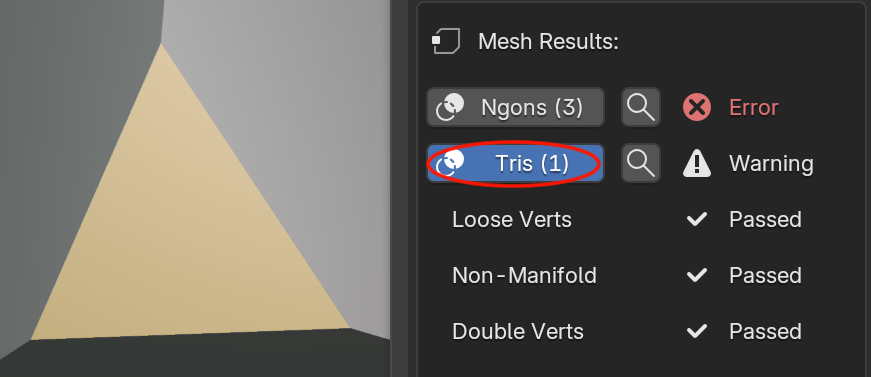
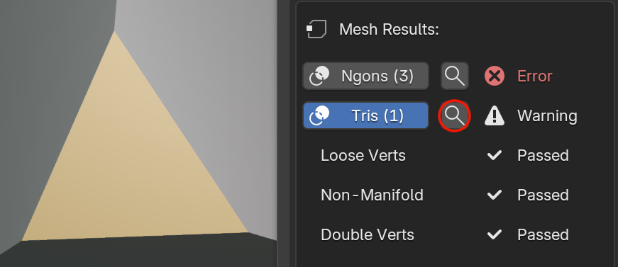

# Reading Results & Overlays

After running an inspection, select an object in the **Objects to Inspect** list to see its **Results** section.

## Result rows

Results are grouped under a header for each category that ran (**Mesh Results**, **UV Results**, **Material Results**). Each check produces one row:

{ style="display: block; margin: 0 auto;" }

## Jumping to the geometry

{ style="display: block; margin: 0 auto;" }

Checks that flag specific faces, vertices, or edges show their result as a clickable button. Clicking it toggles a colored overlay in the 3D Viewport highlighting exactly what was flagged:

- **Faces** (e.g. Ngons, Tris, Overlapping UVs) are highlighted with a translucent colored fill.
- **Vertices** (e.g. Loose Verts, Doubles) are marked with point markers.
- **Edges** (e.g. Non-Manifold) are highlighted with a color along the edge.

Overlay colors match severity: **red** for errors, **yellow/orange** for warnings. Click the result again to turn its overlay off.

## Zooming to flagged geometry

{ style="display: block; margin: 0 auto;" }

Any result with an overlay also shows a 🔍 magnifying glass button next to it. Click it to frame the 3D Viewport on exactly the geometry that check flagged — the same as selecting it and pressing Numpad `.` (View Selected).

If the overlay for that result isn't already toggled on, clicking the magnifying glass turns it on first, then zooms. This is the fastest way to jump straight to a problem without hunting for it in a dense or cluttered scene.

!!! note "Not every check has a visual overlay"
    Some checks describe a property of the object or material as a whole rather than specific geometry — for example *Unapplied Transform*, *Missing UV Map*, *No Material Assigned*, or *Duplicate Material*. These still show a count, but there's nothing specific to highlight, so they're plain text rather than a button.

## Overlays are independent of your list selection

Toggled overlays stay active in the viewport even if you select a different object in the inspection list. You can build up several highlighted checks across several objects at once. Overlays are cleared when you:

- Click **Run Inspection** again
- Click **Remove** an object from the list
- Click **Clear List**.

Next, look up exactly what each check does in the [Inspections](../inspections/mesh-inspections.md).
