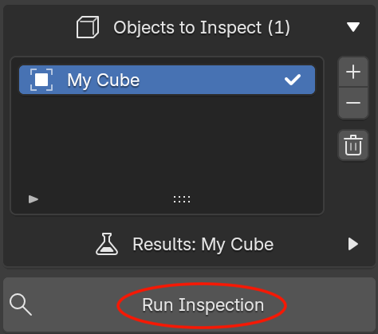
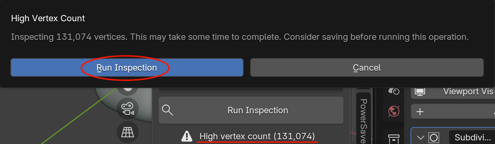

# Running an Inspection

Once you have [objects added](selecting-objects.md) and the specific inspections you want [enabled](interface-overview.md#inspections), click **Run Inspection**.

{ style="display: block; margin: 0 auto;" }

## What happens when you run an Inspection?

1. Any results and overlays from a previous inspection are cleared.
2. Model Inspector builds the list of inspections to run. An inspection only runs if **both** its category and the check itself are enabled.
3. For every object in the inspection list, every enabled inspection runs against that object. Blender's modifiers are taken into account.
4. Each object's results are stored and shown when you select it in the list.
5. Once every object has been checked, Blender's status bar reports how many objects were inspected and how long it took, e.g. `Ran tests on 3 object(s) in 0.42s`. Use it to gauge how much a run costs before scaling up to a bigger batch of objects.

## Before you run

Model Inspector will refuse to run, and report why, if:

- **The inspection list is empty.** Add at least one object.
- **No checks are enabled.** Enable at least one category and at least one check within it.
- **You're not in Object Mode.** Switch out of Edit Mode / Sculpt Mode / etc. first.

## Large meshes

Before running, Model Inspector totals the **evaluated** vertex count (post-modifiers) across every object in the inspection list. If that total is above 100,000 vertices, clicking **Run Inspection** first shows a confirmation dialog warning that the inspection may take a while and suggesting you save your file first. 

{ style="display: block; margin: 0 auto;" }

Confirm to run the inspection anyway, or cancel to trim your object list first. Once this threshold is crossed, the panel also keeps a **High vertex count** warning visible below the Run Inspection button as a standing reminder. This amount will be recalculate as you add objects and run inspections.

## Re-running

Running the inspection again always starts clean. It clears prior results and overlays before re-checking, so results never go stale or mix between runs. This also means overlays you had toggled on will turn off. You can re-enable them from the fresh results if needed. 

!!! info "Non Destructive Guarantee"
    Model Inspector will **NEVER** try to modify your model in anyway.

Next: [Reading Results & Overlays](results-and-overlays.md).
