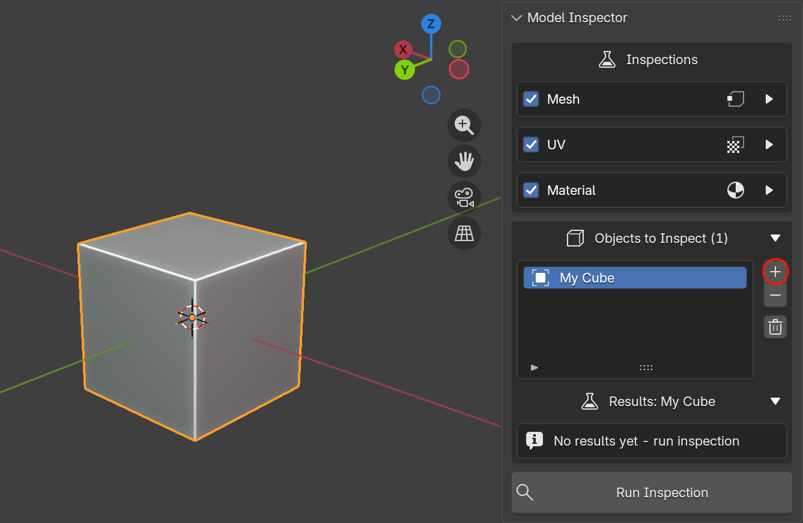
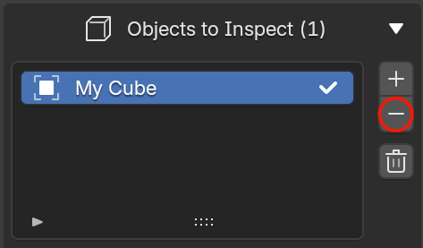

# Selecting Objects

Model Inspector only inspects objects you've explicitly added to its **Objects to Inspect** list. It will **NOT** automatically try to scan your whole scene for meshes. 

## Adding objects

{ style="display: block; margin: 0 auto;" }

1. Select one or more objects in the viewport or the Outliner.
2. In the *Objects to Inspect* box, click the ➕ button.

Every currently-selected object is added. If you attempt to add objects already in the list, they will be ignored, so it's safe to select overlapping groups and add repeatedly if you wish, as you won't get duplicate entries.

!!! tip
    You can build the list incrementally: select a few objects and add them, then select more and add again. The list keeps growing until you clear it.

## Removing objects

{ style="display: block; margin: 0 auto;" }

- Click a row to make it the active entry, then click ➖ to remove just that object.
- Click 🗑 **Clear List** to remove every object at once. This also clears all stored results and turns off any active viewport overlays.

## Objects that no longer exist

If an object referenced in the list is deleted from the scene files, its row will show **`<missing object>`**. Remove it with ➖ or clear the whole list.

!!! info "Deleted Objects Note"
    Objects that have been deleted by e.g. the delete key or x, still remain in the scene files. This means they will still stay in the inspections list. Remember to remove any objects from your inspections list if you no longer wish to inspect them!

Next: [Running an Inspection](running-inspections.md).
